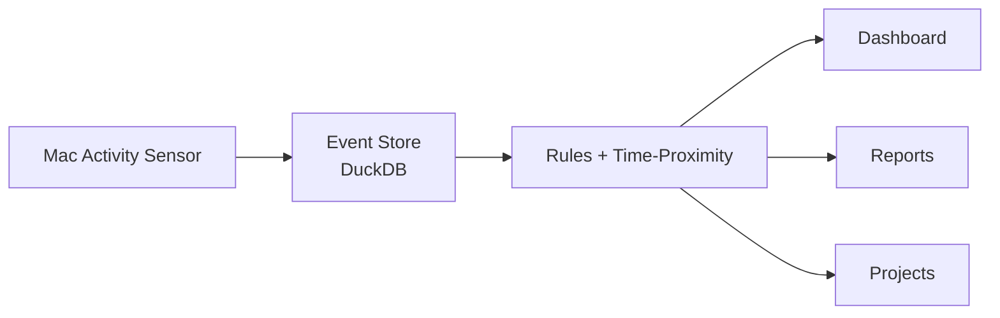
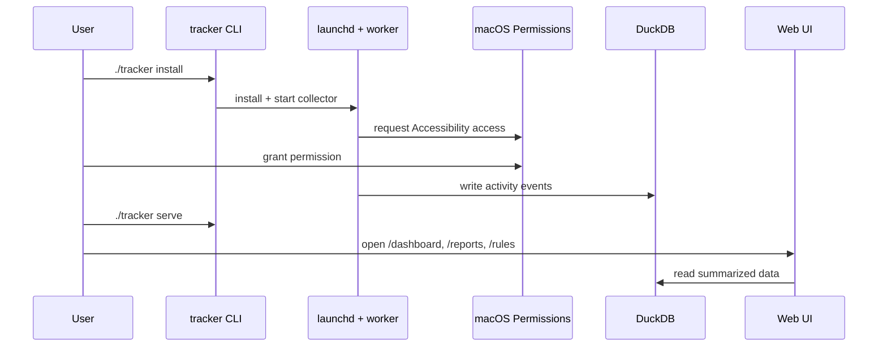
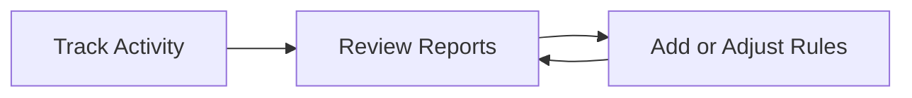

# Getting Started

Time Tracker is a local-first system that records app and window activity on your Mac, stores it in a local database, and helps you turn raw activity into categorized time you can trust.

This guide is for users of the system and explains the concepts you need to operate it day to day.

## What this system does

- Collects activity events from your Mac (app + active window title).
- Stores events locally in DuckDB on your machine.
- Applies rules to map events to projects and activities.
- Uses configured work WiFi patterns to calculate worked hours.
- Shows results in Dashboard, Reports, Rules, Projects, and Settings.

## Core concepts

- **Event**: one recorded activity item (for example, "Google Chrome" with a specific tab title).
- **Rule**: a pattern that maps matching events to a project/activity.
- **Project**: a higher-level bucket for your work (customer, internal project, etc.).
- **Activity**: what you did inside a project (coding, meeting, review, docs, etc.).
- **Work WiFi**: WiFi SSID pattern(s) used to define worked hours in reports.

## How data flows



## First run

1. Install and start the worker:
   ```bash
   ./tracker install
   ```
2. Grant Accessibility permission to the worker binary in:
   `System Settings -> Privacy & Security -> Accessibility`
3. Confirm it is running:
   ```bash
   ./tracker status
   ```
4. Start the web UI:
   ```bash
   ./tracker serve --addr 127.0.0.1:8080
   ```
5. Open `http://127.0.0.1:8080` in your browser.



## Daily use loop

1. **Track**: ensure collector is running (`./tracker status`).
2. **Review**: check Dashboard and Reports.
3. **Improve mapping**: refine Rules.
4. **Repeat**: reports get cleaner as rules improve.



## Common tasks

### Fix uncategorized time

- Go to **Rules**.
- Filter groups for a date with uncategorized time.
- Add a rule from selected events and save draft.

### Set work-hour detection

- Go to **Settings**.
- Set `work_wifis` patterns for your work site networks.
- Re-open reports and verify worked totals.

### Focus work by project

- Go to **Projects**.
- Activate the current project so follow-context rules can map better.

## Troubleshooting

- **Worker not running**:
  - Run `./tracker status`.
  - If needed, run `./tracker start`.
- **No new events appear**:
  - Check Accessibility permission for the worker binary.
  - If still blocked, remove and re-add that binary in Accessibility settings.
- **Need database location**:
  - Default path is `~/.local/share/time-tracker/tracker.db`.

## Next steps

- Run `./tracker help` for command overview.
- Run `./tracker schema rules` for machine-readable command docs.
- Use Dashboard and Reports as your daily feedback loop.
